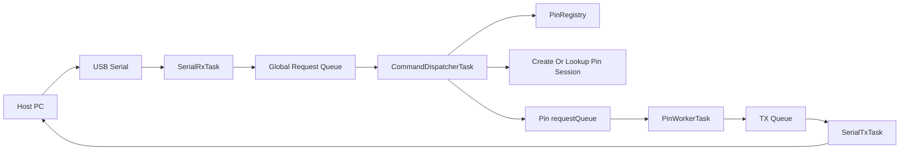
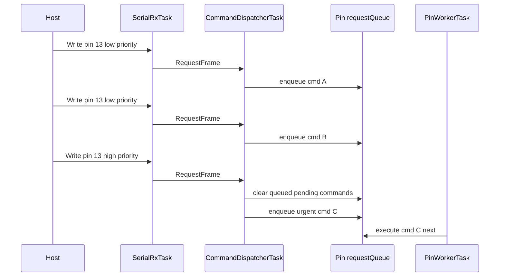

# serial_gpio_extension

serial_gpio_extension is a Teensy 4.1 + FreeRTOS project that exposes GPIO functionality to a host computer over USB serial.
The firmware is intended to accept framed serial commands, create pin sessions on demand from the first functional request, and execute digital, analog, PWM, and servo operations through a controlled runtime model.

## Goals

- Give a computer GPIO access over serial.
- Support digital input and output.
- Support analog input.
- Support PWM and servo-style control.
- Create pin sessions lazily from the first valid read or write request.
- Support command priority so urgent work can replace stale low-priority work for the same pin.

## Current Architecture Direction

The runtime is being designed around these components:

- `SerialRxTask` reads bytes from USB serial, assembles `@...;\n` frames incrementally, parses them into `RequestFrame` objects, and pushes them into one global request queue.
- `CommandDispatcherTask` owns the pin registry, creates sessions for first-use requests, and routes requests to the correct destination.
- `PinRegistry` tracks all active pin sessions.
- Each active pin gets its own worker task and logical command queue.
- `SerialTxTask` is the only task that writes responses back to the host through one global response queue.

The per-pin queue model is implemented as:

- one FIFO request queue per active pin

When a high-priority command arrives for a pin, the firmware clears older queued low-priority commands for that same pin and executes the urgent command next.

## Runtime Flow



This split keeps responsibilities narrow:

- `SerialRxTask` owns ingress parsing.
- `CommandDispatcherTask` owns the registry and all routing decisions.
- `PinWorkerTask` owns pin execution.
- `SerialTxTask` owns egress serialization.

## Request Routing Rules

`CommandDispatcherTask` is the control-plane owner of the system.
It receives parsed requests from the global queue and applies these rules:

- malformed frames are rejected before they enter the global queue
- the first valid read or write for an inactive pin creates that pin session
- low-priority requests for active pins are appended to that pin's `requestQueue`
- high-priority requests clear that pin's `requestQueue` and then enqueue the newest command
- workers send `ResponseFrame` objects by value to the shared TX queue

## Priority Behavior



This behavior is local to one pin.
Traffic for another active pin continues through its own queue and worker without being cleared.

## Protocol Direction

The existing protocol vocabulary lives in [codec.h](codec.h).
The design currently targets an ASCII frame format with:

- `@` as the start marker
- `,` as the field delimiter
- `;` as the end-of-frame marker
- `\n` as the required line ending after each frame

The in-memory model is split into:

- `RequestFrame` for `Read` and `Write`
- `ResponseFrame` for `Response` and `Error`

The wire shapes are:

```text
Request:  @<type>,<requestId>,<pinType>,<priority>,<pin>,<value>;\n
Response: @<type>,<requestId>,<value>,<error>;\n
```

The effective request operation is derived from the `(type, pinType)` pair.
For example, `R + D` means digital read, `W + D` means digital write, `R + A` means analog read, `W + P` means PWM write, and `W + S` means servo write.

Queues carry full `RequestFrame` and `ResponseFrame` structs by value, not pointers.

Supported frame families are:

- `Read`
- `Write`
- `Response`
- `Error`

## Design Document

The full system design is documented in [desingandarcheticture.md](desingandarcheticture.md).
The request parser algorithm is documented in [parser_algorithm_readme.md](parser_algorithm_readme.md).
The proposed object-oriented pin-session layout is documented in [pin_session_layout_readme.md](pin_session_layout_readme.md).

That document defines:

- protocol shape and example frames
- runtime task responsibilities
- per-pin request-queue semantics
- resource limits and validation strategy
- staged implementation order

## Current Repository State

The repository currently contains:

- [codec.h](codec.h) for protocol enums and conversion helpers
- [serial_gpio_extension.ino](serial_gpio_extension.ino) as the current FreeRTOS-based sketch

The sketch is still a demo-oriented runtime, so the next implementation step is to replace the sample tasks with the serial GPIO architecture described in the design document.

## Current Implementation Notes

The codebase has started to move toward the pluggable pin-session model described above.

- `PinSessionFactory` implements a registry of factory callables keyed by `PinType` that the `RequestDispatcher` consults when it needs to create a session for a pin.
- Each pin family module (for example `digital_pin.cpp`, `analog_pin.cpp`, and `servo_pin.cpp`) currently self-registers a factory function at static init time so new session types can be added without modifying central factory code.
- Factories are responsible for creating per-session resources (the `requestQueue` and the pin worker `Task`). A helper `PinSessionFactory::makeSessionWithResources` is provided to reduce duplicated queue/task creation logic across modules.
- Debug and error frames exist on the wire: `@B` (debug) and `@E` (error). At present a helper `SerialSendDebugFrame()` performs direct `Serial` writes for quick debugging; centralizing debug output via the global response queue and `SerialTxTask` is recommended for production to avoid interleaved serial writes.

### Notable runtime defaults

- Several module factories currently use large default per-pin queue depths (for example `kRequestQueueDepth = 1024` in some modules). These defaults can exhaust RAM when many sessions are active; the design recommends starting with small per-pin queues (e.g. 4–16 entries) and tuning up only if needed.
- Worker tasks created by factories generally use a high priority; tasks and priorities are defined in the module factory code. The dispatcher is still the single owner of session lifecycle and routing.

If you are exploring the code, see `documentation/pin_session_factory_readme.md` for the factory API and registration pattern, and `documentation/runtime_issues_and_recommendations.md` for a short list of known issues and recommended fixes.

## Host-Side Parser Test App

The repository now includes a small desktop test harness at [tests/request_frame_parser_test_app.cpp](tests/request_frame_parser_test_app.cpp).
It compiles the real `request_frame_parser.cpp` against tiny host shims for `Stream`, `FreeRTOS.h`, and `queue.h` so parser behavior can be validated without flashing the Teensy.

From PowerShell, compile and run it with either `g++` or `clang++` available on `PATH`:

```powershell
g++ -std=c++17 -Itests/host_shims -I. tests/request_frame_parser_test_app.cpp -o build/request_frame_parser_test_app.exe
.\build\request_frame_parser_test_app.exe
```

The test feeds a mix of valid, malformed, overflowing, and invalid-combination request frames and verifies the queued `RequestFrame` values plus the parser statistics counters.

## Python Serial Sender

Use [scripts/send_test_frames.py](scripts/send_test_frames.py) to send ten sample request frames to the device, wait ten seconds, and then print both the transmitted frames and any newline-terminated responses received back from the board.

Example:

```powershell
python scripts/send_test_frames.py COM5
```

The script depends on `pyserial`.