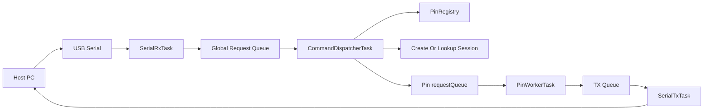

# Serial GPIO System Design and Architecture

## Overview

This project turns a Teensy 4.1 running FreeRTOS into a serial-attached GPIO controller for a host computer.
The host sends framed commands over USB serial, and the firmware executes them against active pins for digital, analog, PWM, and servo workloads.

The core design goal is to make pin control deterministic under load.
Each active pin gets its own execution context so that commands for one pin do not block unrelated pins, while still preserving ordering and priority rules per pin.

## Goals

- Expose Teensy GPIO capabilities to a host computer over USB serial.
- Support digital input, digital output, analog input, PWM, and servo control.
- Require pins to be initialized before use.
- Preserve command order for normal traffic on the same pin.
- Allow a high-priority command to discard older low-priority work queued for the same pin.
- Keep serial parsing, pin execution, and serial responses separated into clear runtime responsibilities.

## Non-Goals for v1

- Persistent pin configuration across reset.
- Host-side libraries or desktop tooling.
- Binary framing.
- Dynamic task or queue deletion after initialization.
- Cross-pin scheduling guarantees beyond normal FreeRTOS scheduling.

## Target Platform and Constraints

- Board target: Teensy 4.1.
- Runtime: FreeRTOS on Teensy.
- Transport: USB serial.
- Pin capabilities differ by physical pin and must be validated at initialization time.
- PWM and servo outputs may share timer resources, so frequency and resolution changes must stay owned by the pin worker responsible for that pin.
- Dynamic queue and task creation is allowed, but active sessions are still naturally bounded by the fixed physical pin registry.

## Design Principles

1. One logical command channel per active pin.
2. Serial input parsing happens in one place.
3. Concrete pin-session construction is pluggable via a `PinSessionFactory` registry. See `documentation/pin_session_factory_readme.md` for current implementation notes and how modules self-register their factories.

Known runtime caveats and recommendations are collected in `documentation/runtime_issues_and_recommendations.md` and should be reviewed when changing queue depths, task priorities, or per-session allocation policies.
3. Serial output happens in one place.
4. Reads are queued like writes so ordering remains consistent per pin.
5. High-priority commands preempt queued low-priority commands only for the same pin.
6. Invalid requests fail fast with explicit error responses.

## Protocol Model

### Frame Shape

Use an ASCII protocol with explicit framing:

```text
Request:  @<type>,<requestId>,<pinType>,<priority>,<pin>,<value>;\n
Response: @<type>,<requestId>,<value>,<error>;\n
```

The leading `@` marks the start of a frame.
The `;` marks the end of the frame payload.
The trailing `\n` finalizes the transport line and is required after `;`.
The parser stores only the payload between `@` and `;`, then validates the expected field count.

### Field Definitions

Request fields:

| Field | Purpose | Example values |
| --- | --- | --- |
| `type` | Top-level request frame type | `I`, `R`, `W` |
| `requestId` | Host-assigned correlation ID | `1`, `42`, `9001` |
| `pinType` | Hardware capability group | `D`, `A`, `P`, `S` |
| `priority` | Queue priority for requests | `L`, `H` |
| `pin` | Physical Teensy pin number | `13`, `14`, `36` |
| `value` | Mode-specific request payload; use `0` when the request type does not consume it | `0`, `1`, `127`, `1500` |

Response fields:

| Field | Purpose | Example values |
| --- | --- | --- |
| `type` | Response frame type | `S`, `E` |
| `requestId` | Echo of the original request ID | `1`, `42`, `9001` |
| `value` | Successful result value or ignored on error | `0`, `1`, `127`, `1500` |
| `error` | Numeric `ErrorCode` value, meaningful only when `type == E` | `0`, `1`, `7` |

### Enumerations

The current protocol vocabulary already exists in [codec.h](codec.h):

- `FrameType`: `R` read, `W` write, `S` response, `E` error
- `PinType`: `D` digital, `A` analog, `P` PWM, `S` servo
- `Priority`: `L` low, `H` high, `N` none

### Frame Semantics

- Request meaning is derived from the `(type, pinType)` pair.
- The first valid `Read` or `Write` for an inactive pin creates the per-pin runtime objects.
- `Read` requests are queued to the pin worker and answered asynchronously.
- `Write` requests are queued to the pin worker and may return an acknowledgement response.
- `Response` returns the original `requestId`, a result in `value`, and an ignored `error` field.
- `Error` returns the original `requestId` and an `ErrorCode` in the `error` field.

### Request Type and Pin Type Relationship

The `pinType` field identifies the hardware family, and the `type` field chooses read or write behavior for that family.

Examples:

- Read a digital pin: `type=R`, `pinType=D`
- Write a digital pin: `type=W`, `pinType=D`
- Read an analog-input pin: `type=R`, `pinType=A`
- Write a PWM pin: `type=W`, `pinType=P`
- Write a servo pin: `type=W`, `pinType=S`

Invalid combinations such as `type=W`, `pinType=A` or `type=R`, `pinType=P` should be rejected.

### Recommended Error Codes

Errors are represented by the numeric `ErrorCode` enum already defined in [codec.h](codec.h).
The `error` field of an error response should carry one of these values:

- `0` = `BAD_FRAME`
- `1` = `BAD_PIN`
- `2` = `BAD_FUNCTION`
- `3` = `BAD_PIN_TYPE`
- `4` = `BAD_VALUE`
- `5` = `MISSING_SESSION`
- `6` = `UNSUPPORTED`
- `7` = `QUEUE_FULL`

### Example Frames

First write to pin 13, which also creates the digital-output session:

```text
@W,1,D,L,13,1;\n
```

Read pin 14, which also creates the digital-input session:

```text
@R,2,D,L,14,0;\n
```

Successful read response:

```text
@S,2,1,0;\n
```

Unsupported operation error:

```text
@E,3,0,6;\n
```

## Runtime Architecture

The runtime is split into six main parts:

1. `SerialRxTask`
2. `GlobalRequestQueue`
3. `CommandDispatcherTask`
4. `PinWorkerTask`
5. `GlobalResponseQueue`
6. `SerialTxTask`



### SerialRxTask

`SerialRxTask` is the ingress owner.
It has the following responsibilities:

- Read bytes from `Serial`.
- Assemble complete `@...;\n` frames incrementally.
- Parse the ASCII fields into internal command objects.
- Validate syntax and required fields.
- Emit immediate error frames when framing or parsing fails.
- Push valid `RequestFrame` objects into the global request queue by value.

`SerialRxTask` should run at a higher priority than worker tasks so serial input is consumed promptly.

### GlobalRequestQueue

The global request queue is the handoff between transport parsing and runtime control.
It decouples USB serial ingress from pin-session ownership so `SerialRxTask` stays focused on parsing instead of touching shared runtime state.
The queue stores full `RequestFrame` objects by value rather than pointers, because request frames are small fixed-size structs and do not need heap ownership.

### GlobalResponseQueue

The global response queue is the handoff between pin execution and serial transmission.
Workers push `ResponseFrame` objects into this queue by value, and `SerialTxTask` is the only task allowed to serialize them to USB serial.

### CommandDispatcherTask

`CommandDispatcherTask` is the control-plane owner of the runtime.
It owns the pin registry and is the only task allowed to create pin sessions or route requests into per-pin queues.

Its responsibilities are:

- Pull parsed `RequestFrame` objects from the global request queue.
- Validate request semantics.
- Create per-pin queues and worker tasks when the first valid functional request reaches an inactive pin.
- Look up existing pin sessions for later `Read` and `Write` requests.
- Route all requests to the pin's `requestQueue`.
- Clear the pin's pending `requestQueue` entries before enqueuing a high-priority request.
- Emit error responses when a request is valid syntactically but invalid semantically.

### PinRegistry

`PinRegistry` should be a fixed-size table indexed by physical pin number.
It stores the runtime state for every active pin session.
The recommended shape is a static `PinSession sessions[kPinRegistrySize]` array indexed by physical pin number, with index `0` left unused so valid pins remain `1..41`.

Each `PinSession` should track at least:

- active flag
- physical pin number
- `PinType`
- `QueueHandle_t requestQueue`
- `TaskHandle_t workerTask`
- mode-specific configuration such as PWM resolution, frequency, or servo pulse range

### PinWorkerTask

Each active pin owns one worker task.
That worker is the only task allowed to touch that pin's runtime behavior after the session exists.

The worker is responsible for:

- Applying writes.
- Executing reads.
- Managing pin-specific timing and hardware configuration.
- Generating responses and passing them to the transmit path.

This keeps per-pin ordering deterministic and prevents multiple tasks from racing on the same hardware resource.

### SerialTxTask

`SerialTxTask` is the only task that writes to `Serial`.
Workers do not print or respond directly.
Instead, they push `ResponseFrame` objects into the shared response queue by value.

This prevents interleaved serial output and keeps the transport logic centralized.

## Per-Pin Execution Model

### Session Lifetime

- At boot, no pin sessions exist.
- When the first valid functional frame arrives for an inactive pin, the runtime validates the pin and requested pin type.
- If valid, the runtime creates the pin session, its per-pin request queue, and the worker task.
- Later requests for that same session type reuse the existing session.
- Incompatible later requests are rejected unless the dispatcher explicitly supports session replacement.
- In v1, pin sessions are reset-lifetime objects. There is no `Deinit` command yet.

### Queue Structure

Each pin session uses one internal channel:

- `requestQueue`: FIFO queue for pending commands on that pin

High-priority behavior is enforced by the dispatcher, not by a separate urgent mailbox.

### Dispatch Rules

Low-priority command:

- Enqueue at the back of `requestQueue`.

High-priority command:

- Clear the pending entries in `requestQueue` for that pin.
- Enqueue the new command at the back of `requestQueue`.

Worker selection order:

1. Execute the command currently running, if any.
2. Otherwise execute the oldest queued command from `requestQueue`.

### Multiple High-Priority Commands

If several high-priority commands arrive before the worker drains the queue, each new high-priority command clears the remaining pending entries and then enqueues itself.
This intentionally treats high priority as a latest-setpoint mechanism.

That behavior is a good fit for output-style control such as PWM or servo updates.
If the host needs every individual request preserved, it should send those requests at low priority.

### Queued Reads

Reads follow the same dispatch path as writes.
They are not executed directly in `SerialRxTask` or `CommandDispatcherTask`.

This preserves per-pin ordering such as:

1. first write creates an output pin session
2. write a value
3. queue a readback if that session type supports it

The resulting response carries the same `requestId` supplied by the host so asynchronous replies can be matched safely.

## Pin Mode Behavior

### Digital Input

- The first `Read` creates the session and sets the pin to input mode.
- `Read` returns `0` or `1`.
- `Write` is rejected as `BAD_FUNCTION`.

### Digital Output

- The first `Write` creates the session and sets the pin to output mode.
- `Write` applies `LOW` or `HIGH`.
- `Read` may optionally return the last driven value, but v1 should prefer rejecting it unless explicitly implemented.

### Analog Input

- The first `Read` prepares the pin for analog reads.
- `Read` returns the measured ADC value.
- `Write` is rejected.

### PWM Output

- The first `Write` validates that the pin supports PWM.
- The worker owns PWM frequency and resolution decisions for that pin.
- `Write` updates the duty cycle or raw PWM value.

### Servo Output

- The first `Write` validates that the pin supports the required timer mode.
- The worker owns servo timing and pulse-width conversion.
- `Write` should accept either angle or pulse width, but implementation must choose one v1 representation and document it.
- If the existing servo work remains on pin 36, keep the current 50 Hz tuning and account for shared timer effects.

## Resource Model

The system must stay predictable on an embedded target.

Recommended starting limits:

- `kPinRequestQueueDepth = 8`

Recommended implementation rules:

- Use fixed-size internal command structs.
- Queue request and response structs by value rather than storing pointers.
- Avoid dynamic string allocation during parsing.
- Preallocate parser buffers with a fixed maximum frame length.
- Measure stack usage with `uxTaskGetStackHighWaterMark()` after each feature phase.

Suggested stack-sizing approach:

- Start `SerialRxTask` higher than workers because parsing is the heaviest control path.
- Start `SerialTxTask` small but not minimal.
- Start `PinWorkerTask` conservatively, then reduce after observing real watermarks.

## Validation Plan

### Phase 1: Digital End-to-End

- Initialize one digital output pin and one digital input pin.
- Verify normal queued writes execute in order.
- Verify queued reads return a response with the correct `requestId`.

### Phase 2: Priority Behavior

- Send several low-priority writes to the same pin.
- Send one high-priority write before the worker drains the queue.
- Confirm older low-priority work for that pin is discarded.
- Confirm traffic for a different pin is unaffected.

### Phase 3: Analog and PWM

- Validate pin capability checks.
- Verify duty-cycle updates and analog values remain within valid ranges.
- Confirm unsupported pins return errors instead of partial setup.

### Phase 4: Servo

- Validate 50 Hz update behavior.
- Confirm the chosen servo value representation behaves correctly.
- Confirm timer-sharing side effects are understood and documented.

### Phase 5: Resource Checks

- Create the intended number of pin sessions.
- Check heap usage after every new session.
- Check task stack high-water marks.
- Confirm no serial responses are interleaved or corrupted under load.

## Implementation Boundaries

In scope for the next implementation pass:

- Protocol framing
- Command parsing
- Pin session registry
- Per-pin worker creation
- Queue priority semantics
- Centralized transmit path

Out of scope for v1:

- Host SDK
- Persistent configuration
- Binary protocol
- Session deletion
- Cross-device synchronization

## Recommended Next Implementation Order

1. Define the internal command and response structs.
2. Extend [codec.h](codec.h) to support request IDs and explicit error codes.
3. Replace the demo tasks in [serial_gpio_extension.ino](serial_gpio_extension.ino) with `SerialRxTask`, `SerialTxTask`, and one basic digital `PinWorkerTask` path.
4. Prove the queue and priority behavior on digital pins first.
5. Add analog, PWM, and servo modes after the digital path is stable.

## Summary

The system should be built around a serial ingress task, a fixed registry indexed by physical pin number, and one worker per active pin.
The per-pin queue model is the right fit for your requirement because it preserves order locally while still letting a high-priority command cancel stale low-priority work for the same pin.

That design keeps the serial transport simple, isolates pin-specific timing, and gives a clear path from the current demo sketch to a real serial GPIO runtime.