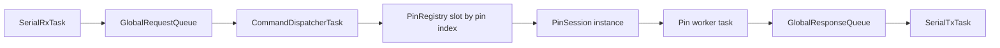

# Pin Session Layout

This document explains the proposed pin-session layout for the runtime.
It describes a target architecture for pin ownership and execution, not the exact implementation that exists in the repository today.

The goal of this layout is to keep the transport path simple while making per-pin behavior easier to isolate.

## Why This Layout Exists

The runtime already has three clear responsibilities:

- serial ingress parses request frames
- a dispatcher decides where requests should go
- per-pin execution owns the hardware behavior for that pin

The new layout focuses on the third part.
Instead of treating every pin as one generic worker with many mode checks, the runtime can model each active pin session as an object that owns its own behavior.

## Design Goal

Each active pin should have:

- one session object that owns the pin's runtime state
- one worker task that executes commands for that session
- one request queue for that session's commands

The registry remains indexed by physical pin number, but each registry slot points to the session instance that currently owns that pin.

## Core Idea

The proposed design uses a base `PinSession` class and derived classes for each pin family.

Examples:

- `DigitalPinSession`
- `AnalogInputPinSession`
- `PwmPinSession`
- `ServoPinSession`

Each derived class implements the behavior that is valid for that pin family.

### Current implementation notes

The repository includes a working variant of this layout with a pluggable factory:

- `PinSessionFactory` provides a registry and a `createFromRequest(...)` entry point used by the dispatcher.
- Modules register their factories at static-init time (self-registration) so new pin families can be added without changing the central factory or dispatcher code.
- A helper `PinSessionFactory::makeSessionWithResources<SessionT>(...)` exists to standardize queue and worker creation and to reduce copy/pasted resource-management code across pin modules.

Be aware of two practical issues observed in the current code:

- Some module factories use large per-pin queue depths (e.g. 1024). On an embedded target this quickly consumes heap when many sessions are active. Prefer small per-pin queues (4–16) or a shared worker model for memory-constrained builds.
- Session teardown and graceful worker termination are not fully standardized. If sessions ever need to be destroyed at runtime, implement a sentinel/shutdown protocol or use RTOS notifications to avoid worker use-after-free and to ensure resources are reclaimed safely.

## Recommended Base Class Shape

The base class should not force every pin type to implement both `read()` and `write()` separately.
That shape looks natural at first, but it fits digital pins better than PWM or servo.

For this protocol, the better base interface is:

```cpp
class PinSession
{
public:
    virtual ~PinSession() = default;

    virtual PinType pinType() const = 0;
    virtual bool supports(FrameType type, const Frame::RequestFrame &request) const = 0;
    virtual ErrorCode execute(const Frame::RequestFrame &request,
                              Frame::ResponseFrame &response) = 0;
};
```

This interface matches the current request model better because request meaning is already derived from `(FrameType, PinType)`.

## Why `execute()` Is Better Than Separate `read()` And `write()`

Not every pin type supports both operations:

- digital supports read and write
- analog input supports read only
- PWM supports write only
- servo supports write only

If the base class requires both `read()` and `write()`, some derived classes are forced to implement methods that can only return an error.
That usually means the abstraction is too rigid.

With a single `execute()` entry point:

- the derived class can validate the request type
- unsupported operations can fail cleanly in one place
- the worker only needs one dispatch call per request

## Derived Session Responsibilities

### `DigitalPinSession`

This session handles digital pin behavior.
It should accept:

- `R + D` for digital reads
- `W + D` for digital writes

The dispatcher creates it from the first digital request for that pin and fixes the
pin's digital mode from that first request. Later requests are only enqueued when
their derived configuration matches the existing session configuration.

### `AnalogInputPinSession`

This session handles analog input behavior.
It should accept:

- `R + A` for analog reads

It should reject writes.

### `PwmPinSession`

This session handles PWM output behavior.
It should accept:

- `W + P` for PWM writes

It owns PWM-specific state such as frequency and resolution.

### `ServoPinSession`

This session handles servo output behavior.
It should accept:

- `W + S` for servo writes

It owns servo-specific conversion and timing details.

## Registry Layout

The registry remains indexed by physical pin number.
That part of the design is still useful because it makes pin lookup constant time and keeps ownership obvious.

Conceptually the registry becomes:

```cpp
namespace PinRegistry
{
    static constexpr uint8_t kMinPhysicalPinNumber = 1;
    static constexpr uint8_t kMaxPhysicalPinNumber = 41;
    static constexpr size_t kPinRegistrySize = kMaxPhysicalPinNumber + 1;
    std::array<PinSession *, kPinRegistrySize> sessions;
}
```

In that layout:

- the array index is the physical pin number
- index `0` is intentionally unused
- a null entry means no active session
- a non-null entry means that pin currently has an owning session object

## Ownership Model

The ownership rules should stay strict:

- `SerialRxTask` only parses request frames
- `CommandDispatcherTask` owns creation, replacement, and routing of pin sessions
- `PinSession` objects own hardware behavior for their pin
- `SerialTxTask` is the only task that writes responses to USB serial

This means the dispatcher should never directly toggle a pin after a session exists.
It should route requests to the session that owns that pin.

## Worker Model

Each active session still keeps the same scheduling model:

- one `requestQueue` that holds pending commands for that pin
- one worker task that drains that queue in order

The worker task becomes simple:

1. wait for the next request
2. ask the session to execute it
3. push a `ResponseFrame` into the global TX queue

The dispatcher owns the priority policy:

- low-priority commands are appended to `requestQueue`
- a high-priority command clears the pin's pending `requestQueue` entries and then enqueues the newest command so it runs next after any in-flight work

## Reconfiguration Rules

If a request arrives for a pin that is already active:

- if the request is compatible with the existing session, reuse that session without changing ownership
- if the request would require a different session type, either reject it or replace the session in a controlled way
- if the existing session is incompatible, the dispatcher must replace or reject it in a controlled way

The important rule is that reconfiguration remains dispatcher-owned.
The system should not let multiple session types race for the same pin.

## Allocation Strategy

For an embedded target, heap allocation should be treated carefully.
This layout does not require unrestricted dynamic allocation.

Safer options are:

- a fixed pool of session objects
- one preallocated slot per physical pin
- placement `new` into statically reserved storage

That keeps the class-based architecture without turning the runtime into a heap-managed object graph.

## Suggested Flow

The request flow under this layout is:



## Advantages

- pin-family logic stays local to one class
- dispatcher code gets smaller and easier to reason about
- hardware-specific behavior is isolated from transport parsing
- future pin families can be added without growing one large switch statement

## Costs

- object lifetime becomes more complex than a plain data struct
- the registry can no longer be a simple array of value-type sessions
- virtual dispatch adds some indirection
- allocation strategy must be designed carefully for Teensy

## Recommendation

This object-oriented layout is reasonable if the project is moving toward richer per-pin behavior and more pin families.
If the runtime stays small, a plain data `PinSession` plus a function table may remain the simpler embedded design.

If this layout is adopted, the next implementation steps should be:

1. define the base `PinSession` interface
2. create derived classes for digital, analog-input, PWM, and servo
3. change the registry to store session ownership per pin index
4. make the dispatcher create and replace session objects
5. make workers call `session->execute(...)` instead of branching on pin type